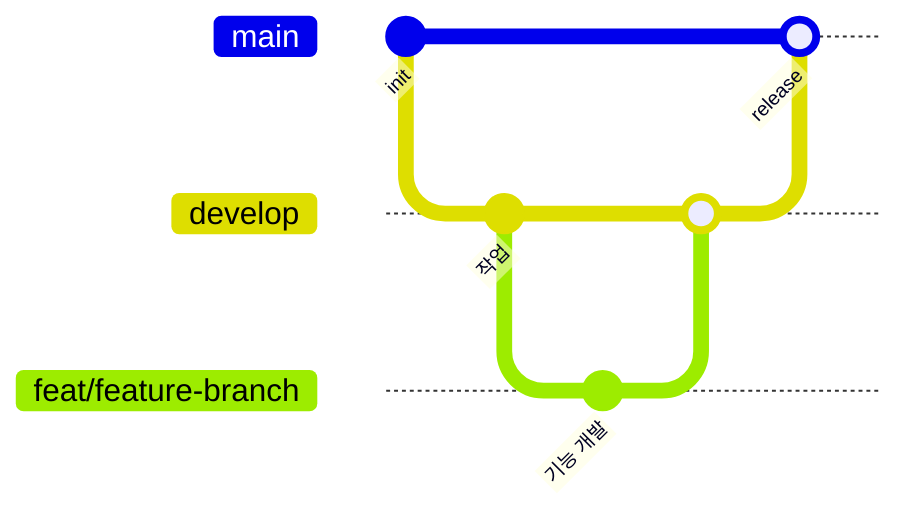

<h1 align="center">✈️ TripUs FrontEnd</h1> 
 
<h2 align="center">🛠️ Tech Stack</h2> 
<table align="center">
  <tr>
    <th width="200px">분류</th>
    <th width="550px">기술 스택</th>
  </tr>
  <tr>
    <td align="center"><strong>Core</strong></td>
    <td>
      
      
      
      
      
      
    </td>
  </tr>
  <tr>
    <td align="center"><strong>Styling</strong></td>
    <td>
      
    </td>
  </tr>
  <tr>
    <td align="center"><strong>UI Components</strong></td>
    <td>
      
    </td>
  </tr>
  <tr>
    <td align="center"><strong>State Management</strong></td>
    <td>
      
      
    </td>
  </tr>
  <tr>
    <td align="center"><strong>Forms</strong></td>
    <td>
      
      
    </td>
  </tr>
  <tr>
    <td align="center"><strong>Development</strong></td>
    <td>
      
      
      
      
    </td>
  </tr>
  <tr>
    <td align="center"><strong>Code Quality</strong></td>
    <td>
      
      
      
      
    </td>
  </tr>
  <tr>
    <td align="center"><strong>Deployment</strong></td>
    <td>
      
    </td>
  </tr>
</table>
 
<h2 align="center">👥 Members</h2>

<table align="center">
  <tr>
    <th align="center" width="150px">
      멤버
    </th>
    <th align="center" width="600px">
      역할
    </th>
  </tr>
  <tr>
    <td align="center" width="150px">
      유상협
    </td>
    <td>
      <h3>💻 기능 개발</h3>
      <ul>
        <li>댓글 및 대댓글 기능 구현</li>
        <li>채팅 목록 UI/UX 구현</li>
        <li>Socket IO 기반 채팅 기능 구현</li>
      </ul>
    </td>
  </tr>
  <tr>
    <td align="center" width="150px">
      김현석
    </td>
    <td>
      <h3>🔧 인프라 & 개발 환경</h3>
      <ul>
        <li>프로젝트 초기 세팅 및 저장소 구성</li>
        <li>테스트 환경 구성 (Storybook, Jest, Playwright)</li>
        <li>MSW 기반 API 모킹 환경 구축</li>
      </ul>
       <h3>💻 기능 개발</h3>
      <ul>
        <li>프로필 페이지 / 마이페이지 UI/UX 구현</li>
        <li>SSE 기반 실시간 알림 시스템 적용</li>
        <li>로그인 / 회원가입 구현</li>
      </ul>
    </td>
  </tr>
  <tr>
    <td align="center" width="150px">
      김수환
    </td>
    <td>
      <h3>💻 기능 개발</h3>
      <ul>
        <li>게시글 생성 / 수정 / 삭제 구현</li>
        <li>게시글 목록 UI / UX 구현</li>
        <li>게시글 상세 UI / UX 구현</li>
      </ul>
    </td>
  </tr>
</table>
 
<h2 align="center">🔄 Development Workflow</h2> 

  

 
<h2 align="center">🐙 Git branch</h2>

 
<h2 align="center">📐 프로젝트 구조</h2>
### 1. 컨벤션
### 2. 폴더 구조
 
